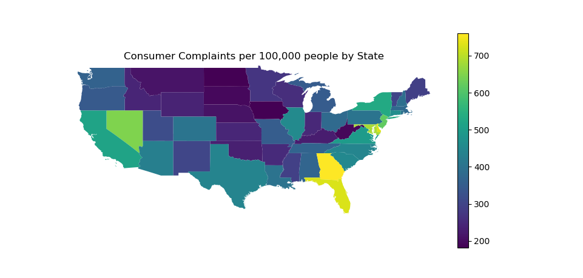

# Mapping-Complainers
This program uses matplotlib to create this image, could easily be adapted for other state sorted data, such as income, unemployment etc.
Program will ask you if you want to download the consumer complaints dataset in order to make the graph.

This may take a while as the file it downloads gets extracted to 1.1GB.

